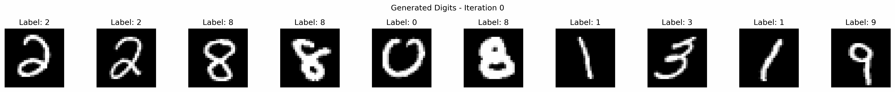
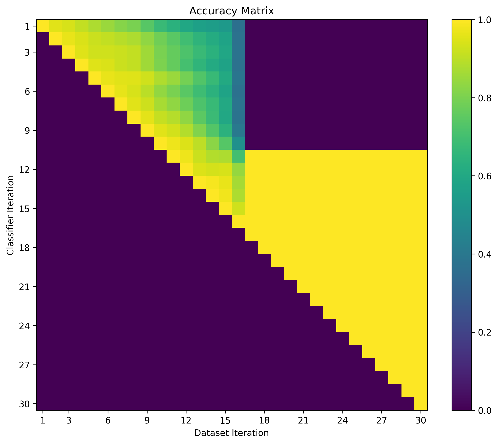
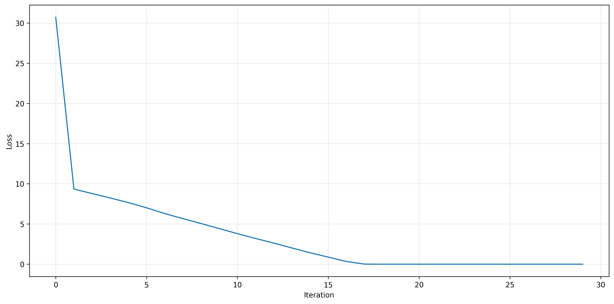
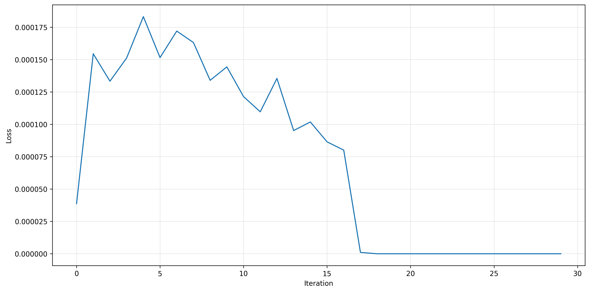
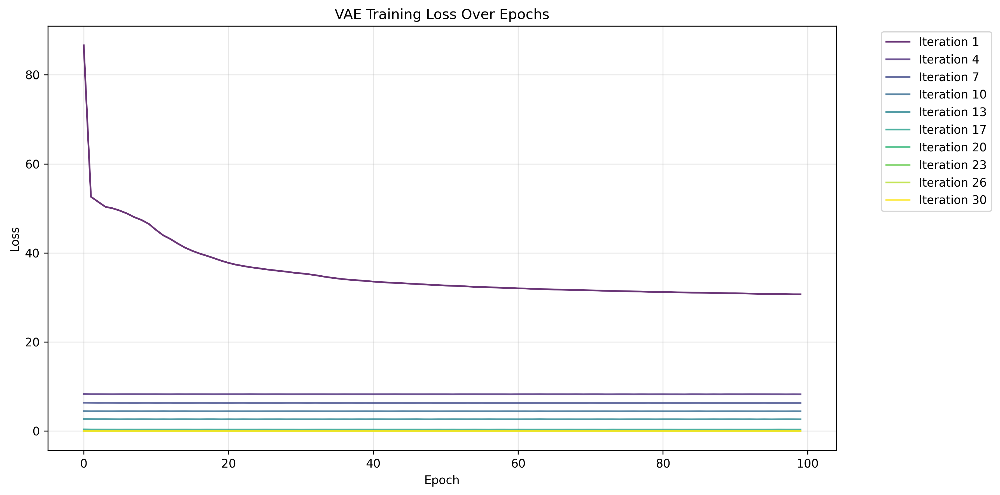
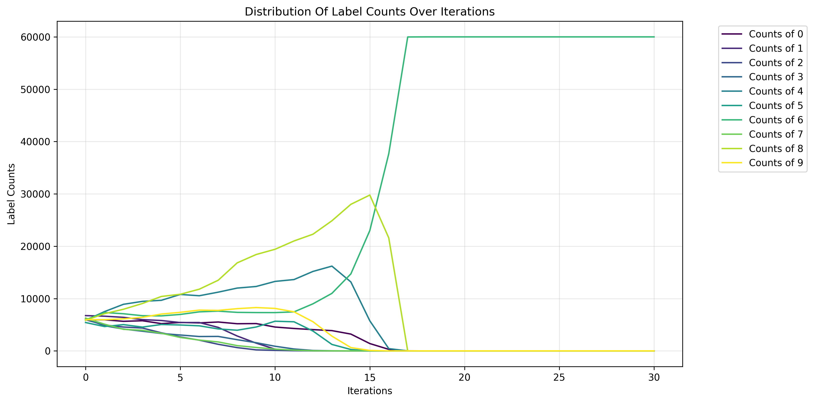

# Model Ouroboros

This project demonstrates model collapse using VAEs trained on MNIST data.

Model Collapse refers to the degradation in model quality when trained on its own outputs. Given the importance of LLMs in frontier AI development and the now ubiquitous presence of LLM outputs in internet text archives, this phenomenon could slow or otherwise severely disrupt the creation of new foundation models over the next couple of years



## Training Process

A simple Variational Autoencoder (VAE) is trained on the MNIST dataset. A simple classifier, defined as a linear network, is also trained on the dataset.

The VAE then has 60,000 samples drawn (the same number as are in the training dataset of MNIST) to form an entirely new dataset. This new dataset is used as further training data for the VAE, and an entirely new classifier is trained on this new dataset.

The same VAE is continually trained on its own outputs, and sampled from each iteration. As can be clearly seen, the model not only gradually ceases to produce images which look like original MNIST samples, but the outputs look more and more similar over time. Eventually, the outputs almost always start to look like blurred 8s, and stop evolving.

Model collapse can be seen by looking at the samples degrade and converge over time. It can be somewhat quantified by taking the classifiers trained on each dataset iteration, and evaluating them on one anothers datasets. The later classifiers show no ability to classify the real MNIST dataset while the earlier classifiers retain some ability, implying that the dataset simplifies rather than entirely losing any resemblance to the original data.

## Findings

### Classifier Accuracy

Model collapse reliably shows this property of slowly creeping along, before suddenly almost all data diversity has been removed.

One way to evaluate this is to apply classifiers on the datasets generated at different iterations. Assuming that the (dense FNN) classifiers find relevant features in the datasets such that they can appropriately classify the digits, this will give a metric of how similar different distributions are.



The accuracy of classifiers slowly degrades until around iteration 17, when the data distribution snaps to a new stable point. Around this iteration, data diversity has largely degraded.

### Final Loss

Looking at the loss at the end of training for the VAE and the classifier, we can start to get a better idea of what is happening here.

| VAE Final Loss         | Classifier Final Loss  |
| ---------------------- | ---------------------- |
|  |  |

The classifier's final training loss tells a story of struggling to keep up with the shifting training distribution. However, you should note that this is the loss of a given classifier matching the labels assigned by the previous classifier. Higher loss while the data distribution is changing is therefore expected.

At the end of training at different iterations, the VAE gets more stable entirely due to the effects of resampling. This can be seen by the fact that the VAE training loss becomes completely flat after some iterations. The loss declines not because of further training; after the first iteration the model had already successfully converged. It declines because each iteration of sampling moves the data closer to the existing expectations of the trained model.



### Label Frequencies

Looking at the distribution of label frequencies at different iterations of this process, we can begin to see what has happened. 

Here, the label counts from the 'current classifier' refer to labels assigned by the classifier trained at that specific iteration. Recall that these classifiers are trained to match the labels from the previous classifier, making them bootstrapped feature extractors. The label counts from the 'initial classifier' refer to labels assigned by the classifier trained on the original dataset, which has the same architecture as all subsequent classifiers (dense FNN).

| Label Counts (Current Classifier) | Label Counts (Initial Classifier) |
| ---------------------- | ---------------------- |
|  |  |

At iteration 17 (note that the exact iteration where this transition occurs depends on the `./config.yaml` used, and includes probabilistic variance), the dataset consists entirely of 8s.

The persistent preference for 8s is likely due to the symmetry, and similarity of the shape to those of other digits.

Convergent images should be very near the maximum likelihood region of the model's latent space. Empirically, it seems that a rough 8 figure is also the convergent image for models trained on the EMNIST dataset also.

## Quick Start

To run this experiment yourself, first clone the repository locally.

```bash
git clone https://github.com/lysandermawby/Model-Ouroboros.git
```

To install relevant dependencies, run the `./setup.sh` script.
Note that this repository assumes that you have [uv package management](https://docs.astral.sh/uv/getting-started/installation/) available. Despite this, a `./requirements.txt` file is made available for users of older package management systems.

```bash
# if you have uv installed
chmod +x setup.sh
./setup.sh
# if you want to use pip instead, note that you will need to find your own appropriate pytorch wheel
pip install -r requirements.txt
```

The core functionality, including downloading data, training and sampling from models, and visualising data can all be accessed through the `src/main.py` script.

```bash
cd src
uv run python main.py
```

You can change many features of the training process using the associated CLI, or by setting a `./config.yaml` file.
Command line arguments passed to `./main.py` overwrite the contents of the config file.
To see a list of the command-line arguments available, run `./main.py` with the help command.

```bash
uv run python main.py --help
```

## GPU Acceleration

Model-Ouroboros will work as expected on either CPU or CUDA-enabled GPU.

As currently written, this will not utilise any GPU without CUDA support. If `nvidia-smi` is detected, then PyTorch is downloaded using a wheel specifically with CUDA 12.1 support (see `./setup.sh` for more details).

Empirically, performance improvements using the CUDA version as opposed to only a CPU provide moderate improvements of around 2x for reasonably-sized models.

## Clear Processed Data

To clear previous runs, run the `./experiments/delete_runs.sh` script.
**WARNING:** Doing this will delete every run in your experiments directory. Before doing this, ensure that you have collected all the relevant runs you would like to keep.
This script is intended to be used to free up disk space after development. You do not want to do this after running your own custom experiments.
